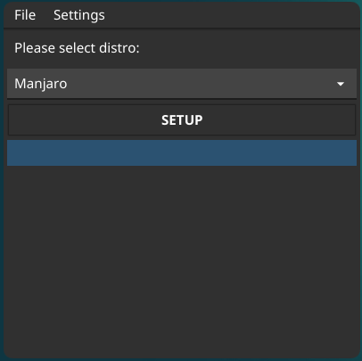
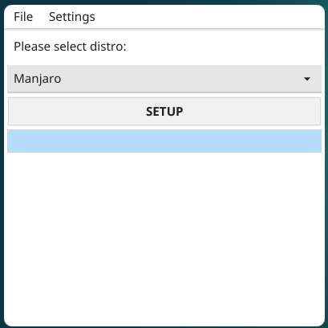
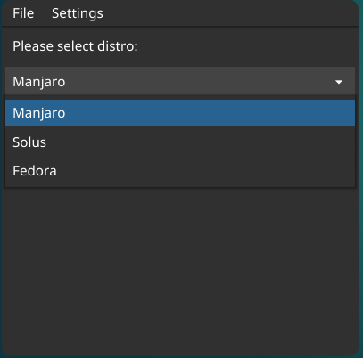
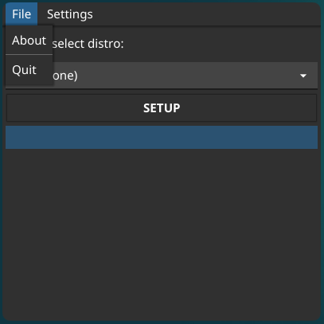
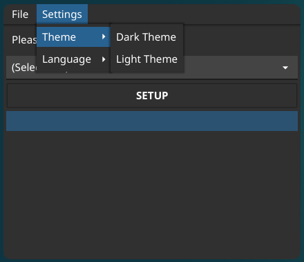
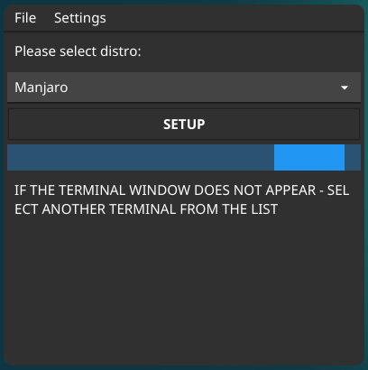
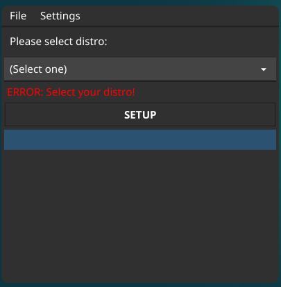

### GOAPPLE GUI



GUI version of [GOAPPLE-CLI](https://github.com/Avdushin/GOAPPLE), written at Go Fyne.

### Dependencies

`make`

```
# to install make:

# Manjaro
sudo pacman -S make
# Solus
sudo eopkg it make
# Fedora
sudo dnf install make
```


### How to install

```
git clone https://github.com/Avdushin/goapple-gui
cd goapple-gui
sudo make install
# Click at the goapple-gui icon or 
goapple-gui
```

or u can use

1) 
  ```
   git clone https://github.com/Avdushin/goapple-gui
   cd goapple-gui
   ./install.sh
   ./goapple-gui
   ```
   
2) 
  ```
   sudo make install
   ./goapple-gui
   ```

### Usage

 * app's menu


* select  distro to install

  

#### menu

* File -> about

  Open Browser link about app

  


* Settings -> Themes ->

  You can select app's theme dark/light

  

* App running ->

  When app is running - progress bar running! At this moment, application installing selected configuration

  

* Error (if you don't selected distro) ->

  


<p align="center">2022 © <a href="https://github.com/Avdushin" target="_blank">Avdushin</a></p>
