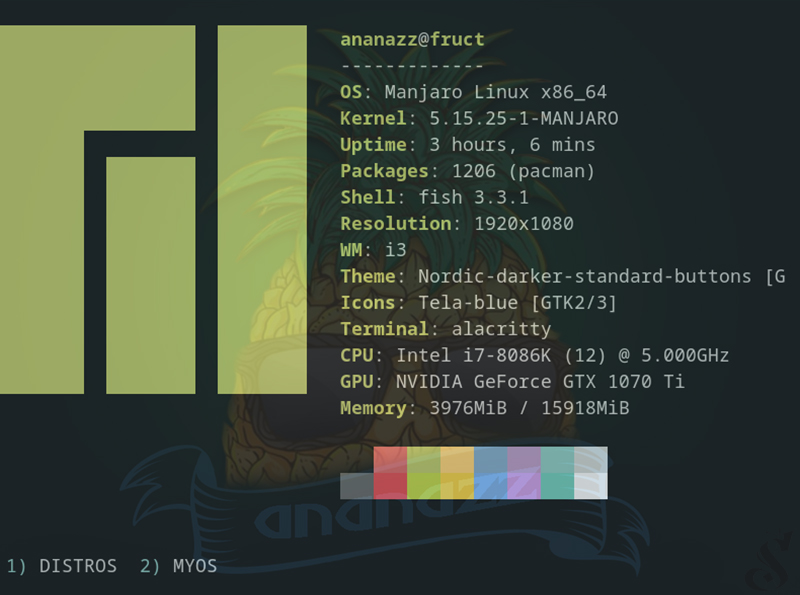

<h2 style="text-align: center; font-size:35px; font-weight: 500;">GOAPPLE</h2>


[GOAPPLE](https://github.com/Avdushin/GOAPPLE) is a small application for quickly setup the I3-WM window manager.
It helps acquaintance with I3-wm, and saves a lot of time thanks to ready-made configs.
The utility is written in Golang in conjunction with shell-scripts, which makes it fast and simple. Just "Keep It Simple, Stupid".
I hope with this program I will help you understand the I3-WM window manager.

## DEPENDENCIES

`make`

```
# Manjaro
sudo pacman -S make
# Solus
sudo eopkg it make
# Fedora
sudo dnf install make
```
## INSTALLATION

```
git clone https://github.com/Avdushin/GOAPPLE
cd goapple
sudo make install
# Click at the goapple icon or 
goapple
```
## DEMO

### GOAPPLE-CLI





### GOAPPLE-GUI


 * app's menu


 * select  distro to install

  

#### menu

* File -> about

  Open Browser link about app

  


* Settings -> Themes ->

  You can select app's theme dark/light

  

* App running ->

  When app is running - progress bar running! At this moment, application installing selected configuration

  

* Error (if you don't selected distro) ->

  

<p align="center">2022 © <a href="https://github.com/Avdushin" target="_blank">AVDUSHIN</a></p>
